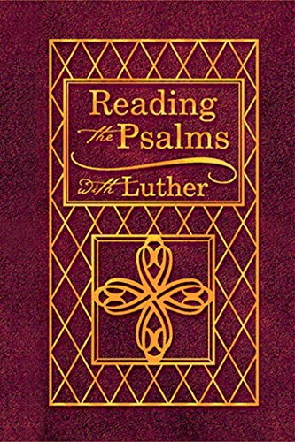

# ReadingThePsalmsWithLuther.github.io
Reading the Psalms with Luther eBook

This is an English translation of Luther's Summaries of the Psalms, 1531 which was originally done in 1993. This latest edition includes the ESV translation of the Psalms, Luther's introductions to each of the 150 psalms and a suggested schedule for reading the Psalter. The introductions demonstrate how Luther understood the Psalter as a Christ-centered book and how he used the psalms as the model for Christian prayer. Luther classifies each psalm as a psalm of prophecy, instruction, comfort, prayer, or thanksgiving and applies the message of the text to the life lived out under the cross. Luther also connects the psalms to the Ten Commandments and the petitions of the Lord's Prayer. For Luther, all aspects of the Christian's life, including the Psalms, relate to Christ and His Gospel of forgiveness, life, and salvation. This edition was published on June 30, 2007. Note: this is a digitized copy of the hardcover book.

*[ReadingThePsalmsWithLuther.pdf](ReadingThePsalmsWithLuther.pdf)*
